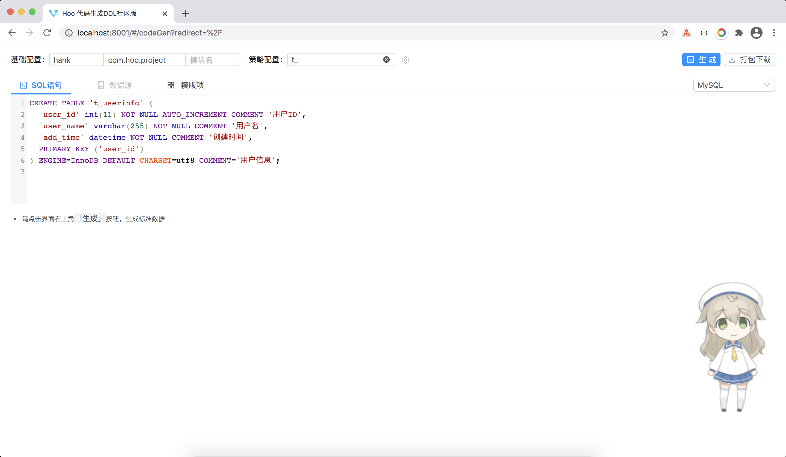
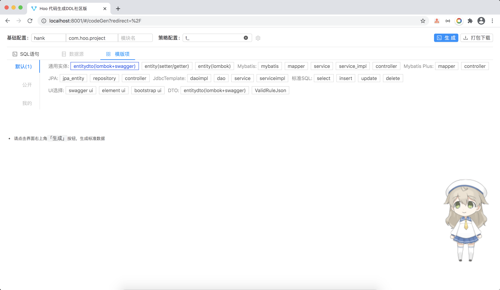
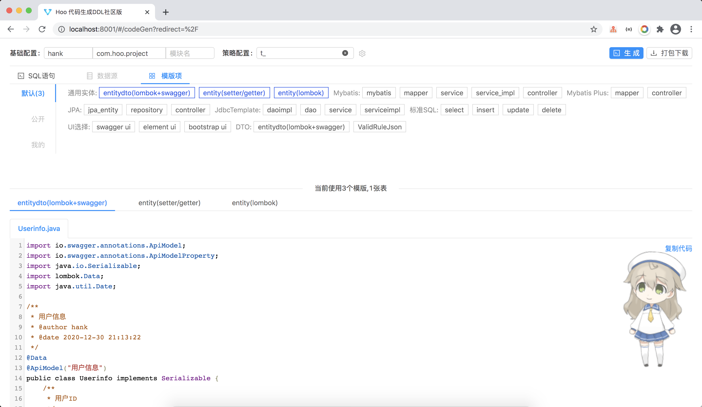
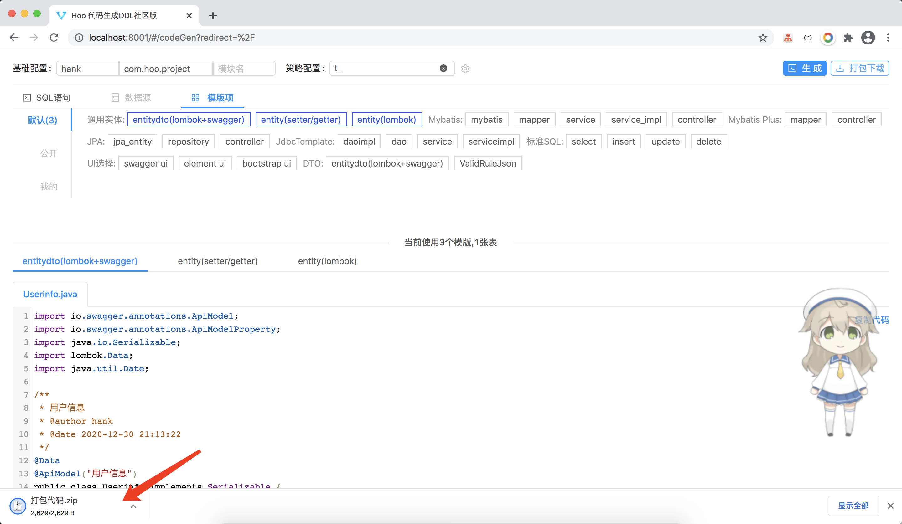

# DDL代码生成社区版

## 启动

- mybatis-plus-generator-3.2.1_hq.jar 依赖导入maven仓库
- 直接运行 CodeGeneratorServerApplication 类即可，访问: http://localhost:10021
- <del>数据持久化</del> 因h2支持类型限制，数据无法导入，有兴趣的可以自行研究，接口返回模版项与sql数据一致

## 系统特点

- UI，Ant Design Vue，视觉效果好  
- 支持主流数据库DDL语法（MySQL、Oracle、PostgreSQL、msSQL）,理论上还可以扩展支持
- 支持代码复制、打包下载
- 支持多表，极快的响应速度

# 功能展示

## 不支持

- 联合主建表生成，待逻辑支持
- DDL中不支持解析索引等语句

## 版权说明

本项目仅限个人免费使用，需保留版权标识，不允许二次开发使用（注该项目灵感源于[开源项目](http://java.bejson.com/generator),这里表示感谢,但是实现逻辑及思路完全不同）

欢迎提需求，留言即可！

## 后续计划

- 支持数据源方式(mybatis-plus基础上完善)
- 开放用户自定义模版及开放文档说明及在线调试功能
- VIP 模版，预计收费（10.24元开放VIP，定价你懂的）

# 赏口饭吃
